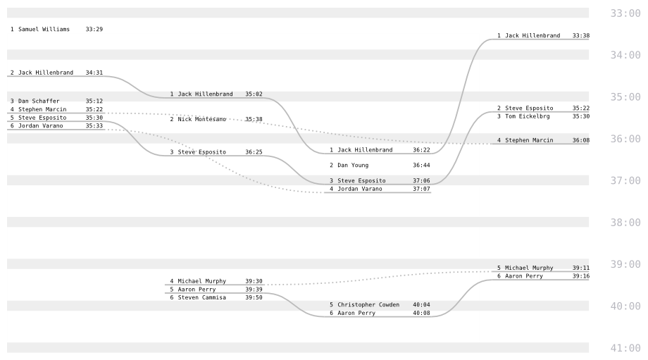
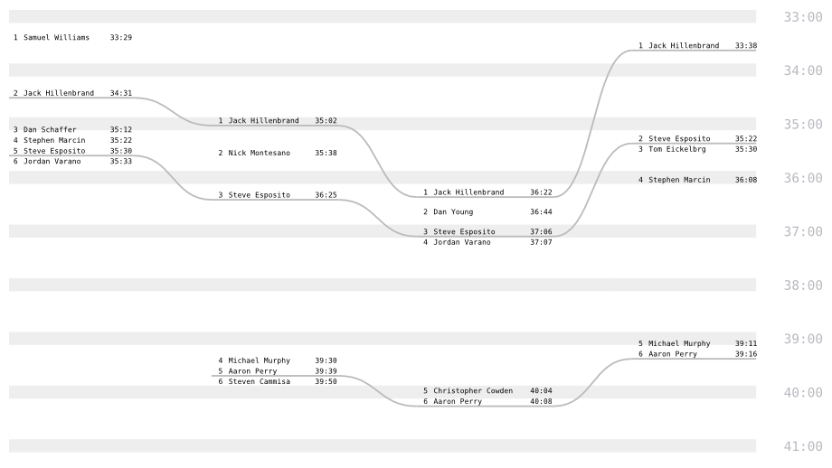
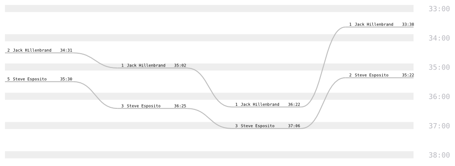
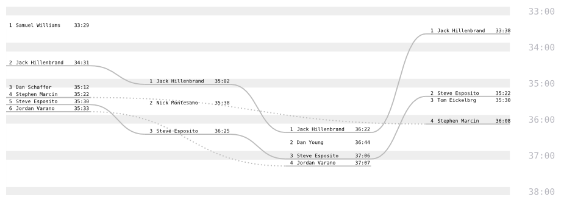
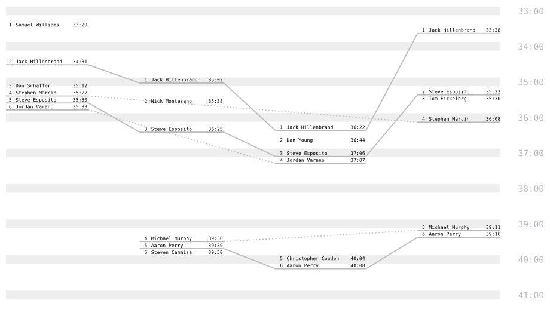
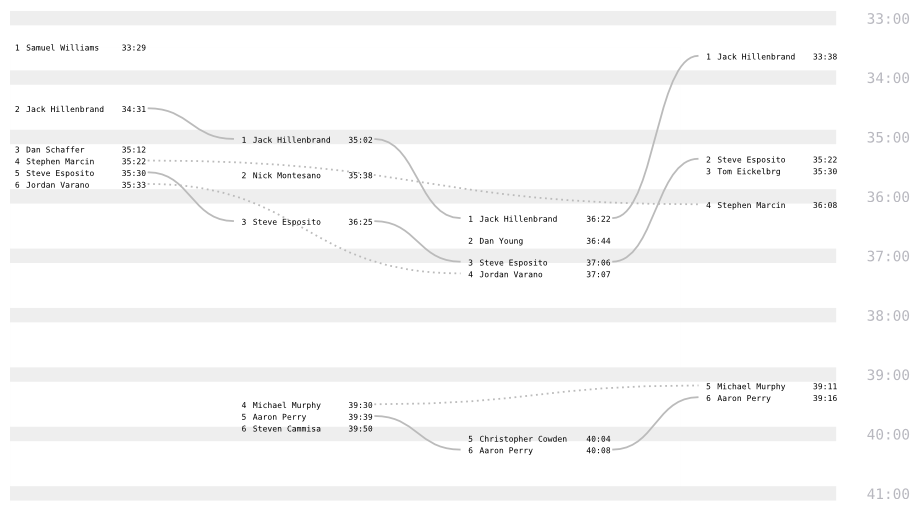
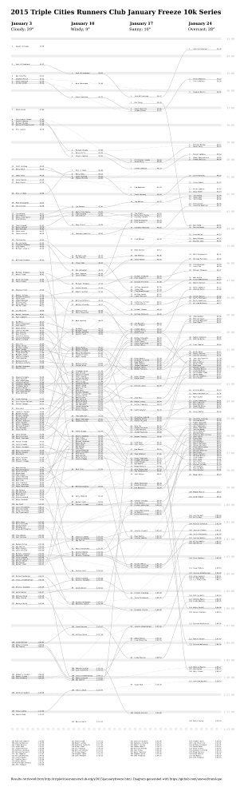
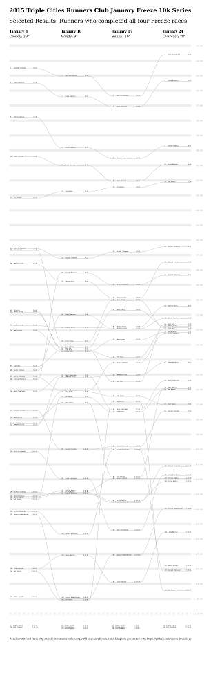

# runslope

Visualize race results as a [slopegraph](http://www.edwardtufte.com/bboard/q-and-a-fetch-msg?msg_id=0003nk) with finishing times for each race in a series as the variable. The distribution of finishers at each race can be compared and each individual's performance can be traced through the series.

## Usage

Reads race results in CSV format from standard input. Prints SVG XML to standard output. 

Expected CSV fields are: `RACE` (arbitrary sequentially-sortable identifiers), `NAME` (assumed unique; may appear multiple times, no more than once per `RACE`), and `TIME` (H:MM:SS format).

Options are set by directly editing the `config` hash or by giving the path to an equivalent YAML file as the first command line argument. Check out [`config/results.yaml`](config/results.yaml) for an annotated example.

	./runslope.py [config.yaml] <results.csv >slopegraph.svg

## Scope

The focus is on positioning result labels and link lines. Not intended to support every option needed to produce arbitrary publication-ready graphics. Import the output into a page layout program and select element groups to adjust styles or add annotations.

## Examples

Here is an example using the first six finishers from each race in a four-race series. Data file `top6.csv` looks like this:

```csv
"RACE","NAME","TIME"
"1","Samuel Williams","33:29"
"1","Jack Hillenbrand","34:31"
"1","Dan Schaffer","35:12"
"1","Stephen Marcin","35:22"
"1","Steve Esposito","35:30"
"1","Jordan Varano","35:33"
"2","Jack Hillenbrand","35:02"
"2","Nick Montesano","35:38"
"2","Steve Esposito","36:25"
"2","Michael Murphy","39:30"
"2","Aaron Perry","39:39"
"2","Steven Cammisa","39:50"
"3","Jack Hillenbrand","36:22"
"3","Dan Young","36:44"
"3","Steve Esposito","37:06"
"3","Jordan Varano","37:07"
"3","Christopher Cowden","40:04"
"3","Aaron Perry","40:08"
"4","Jack Hillenbrand","33:38"
"4","Steve Esposito","35:22"
"4","Tom Eickelbrg","35:30"
"4","Stephen Marcin","36:08"
"4","Michael Murphy","39:11"
"4","Aaron Perry","39:16"
```

The results for each race in the series are shown in columns from left to right. Finishing time is visually represented by the vertical distribution of result labels; the same scale is used for all races, facilitating comparison of individual and overall results. Solid lines connect an individual's results from consecutive races; dotted lines span skipped races to connect returning runners with their earlier results.

```yaml
cutoff: null
strict: false
weaklink: true
curve: 0.5
```



To focus attention on consecutive finishes, hide dotted lines between disjunct results:

```yaml
weaklink: false
```



Setting the `strict` property to `true` carries this emphasis on attendance even further. Individuals who were not present for all races are not shown. Actual finishing ranks are still displayed in the result labels:

```yaml
strict: true
```



If a `cutoff` time is specified, slower results are omitted from the output:

```yaml
cutoff: '38:00'
strict: false
weaklink: true
```



Set the `curve` property to `0` for straight lines. Compare slopes to compare changes.

```yaml
curve: 0
```



Set the `underline` offset to `0` to omit underlines; only connector lines will be shown.

```yaml
underline: 0
```



Legibility is maintained by shifting close result labels down until they don't overlap. As a result, dense packs of finishers will inevitably be plotted inaccurately. This can be mitigated by adjusting the overall `vscale` (higher values spread out the results more) or, to some extent, by reducing the `overlap` margin.

## Poster Project

Developed mainly to visualize the results of my running club's [2015 "January Freeze" 10k series](http://triplecitiesrunnersclub.org/y2015/januaryfreeze.html). Check out the [complete](pdf/results-poster.pdf) and [selected](pdf/results-strict-poster.pdf) results posters.

[](images/results-poster-72dpi.png) [](images/results-strict-poster-72dpi.png)

## Prerequisites

Requires [PySVG](https://code.google.com/p/pysvg/) (for output) and [PyYAML](http://pyyaml.org) (for reading optional config file; easily excised).

## Acknowledgements

Modeled after Ben Concutere's [sg](https://github.com/concutere/sg).

## License

This project is released under an open source [MIT license](http://opensource.org/licenses/MIT).
